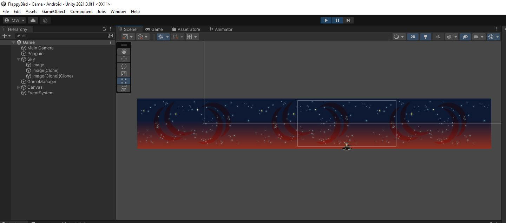
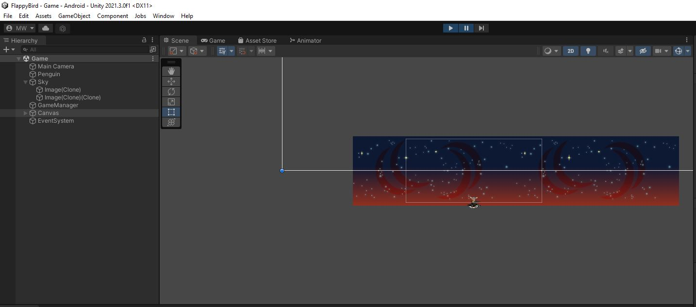

# RepeatBackground.cs
In the Scene, you'll find the background Sprite set up as a **GameObject** "Sky" with a single child called "Image".\
The background needs to scroll past forever. To do this, we simply need to keep creating new copies of it on the right side of the screen while deleting the copies that scroll off the left side of the screen.\
Meaning the "Image" object will need to be repeated indefinitely as you play.
I have set up a script to start you off in RepeatBackground.cs
```
public class RepeatBackground : MonoBehaviour
{
    Bounds m_bounds;

    // Start is called before the first frame update
    void Start()
    {
        Renderer renderer = GetComponentInChildren<Renderer>();
        if (null == renderer)
        {
            Debug.LogError("RepeatBackground with no renderer");
            Destroy(this);
        }
        m_bounds = renderer.bounds;
    }

    // Update is called once per frame
    void Update()
    {
        {   // TODO add new tiles to fill to the right
        }

        {   // TODO remove tiles on the left
        }
    }
}

```
In the `Start()` function, I have calculated the `m_bounds` for you.
You may want to use these bounds (`m_bounds.size` specifically) to determine how far apart to space the copies.\
\
I've split the task of tiling into 2 steps. First we'll create new tiles to fill in on the right. Second we'll delete the old ones as they scroll off the left.

## Fill in tiles on the right
Head to `RepeatBackground.Update()` and find the first **TODO**
```
        {   // TODO add new tiles to fill to the right
        }
```

{: .todo}
* Get the right-most copy of "Image" using `transform.GetChild()`
    * You need to specify the child index
    * The number of children is available as `transform.childCount`
    * Arrange them from left-to-right so the right-most is the last one
* Get the *Renderer* of that right-most child object
    * You can use `Transform.GetComponent<Renderer>()`
* Use `Renderer.bounds` to figure out the right-most edge of that renderer (in world-space)
* Once you have the right-most edge, use `Camera.main.WorldToViewportPoint()` to convert that into view-space
    * In view-space, the coordinates go from 0.0f on the left to 1.0f on the right
    * If the right-most edge is less than 1.0f view-space coordinate, there must be blank space on the right side of the screen
* If the right-most edge is anywhere left of the right edge (less than 1.0f),
    * `Instatiate` a copy of the "Image" object
    * Position that copy to the right of the right-most child
        * `m_bounds.size` tells you how far to the right you need to place the object
    * Add the new copy as a child (a sibling of "Image") using `Transform.SetParent()`
        * The new copy will become the new right-most (last) sibling

{: .test}
You should now get new copies of the "Image" object appearing as you scroll to the right.\
Looking in Scene view can give you a good sense of whether this is working or not.\


{: .note}
You can select the Scene view while you're playing.

## Delete the tiles on the left
Back in `RepeatBackground.Update()` let's do that second **TODO**
```
        {   // TODO remove tiles on the left
        }
```

{: .todo}
* Get the left-most copy of "Image"
    * We arranged the children from left-to-right so the left-most is the first one
* Get the **Renderer** and the **Bounds** to find the right edge of the left-most child
* Convert that right edge position into view-space
* If that right edge is off the left of the screen (less than 0.0f),
    * Delete the child with `Destroy()`

{: .test}
Play in editor to make sure the scrolling background works.\
Use Scene view to make sure the background tiles are getting deleted as they scroll off the left.


{: .warn}
It's a good idea to commit and push before going any further.