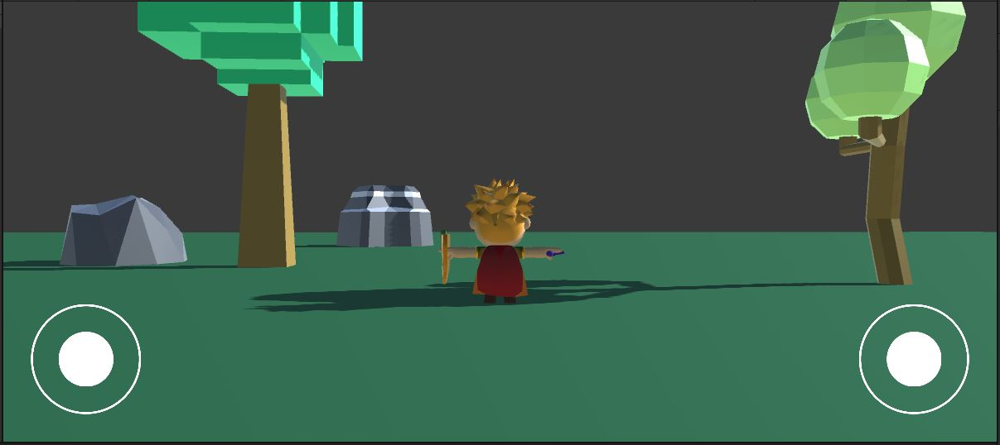

So far, all of our controls are keyboard-based, but this is *Mobile* Games!\
There are no keyboards in *mobile* games.

# Virtual Joystick
Fortnite uses virtual joysticks, and we'll be doing the same.\
I'm not a huge fan of relying too much on downloaded code, but there's no sense reinventing the wheel.\
I have downloaded this [Joystick Pack](https://assetstore.unity.com/packages/tools/input-management/joystick-pack-107631#description).\
You can find it as "Assets/Joystick Pack".

{: .todo}
* Set up a UI Canvas in your scene
	* Make sure it is set up to scale properly
* Drop an instance of "Assets/Joystick Pack/Prefabs/Fixed Joystick.prefab" onto the canvas
	* This will be for the character controls
	* Size and place it accordingly in the lower-left for a landscape game
* Make another one just like it in the lower-right for the camera controls

## Player Controls

{: .todo}
* Give **Character** a public reference to a **Joystick**
* Point it to the virtual joystick in the lower-left
* In `Character.Update()` where you read the keyboard for input
	* *Also* read from the **Joystick** 
	* The player should respond to either the keyboard or the virtual joystick in the same way

{: .note}
This is one of the main purposes of the **Character.CharInput** class.\
The class abstracts the source of the input so that the ultimate behavior won't change whether the input comes from keyboard or virtual joystick

{: .test}
You should now have control the the player through the virtual joystick

## Camera Controls

{: .todo}
* Give **FollowCamera** a public reference to a **Joystick**
* Point it to the virtual joystick in the lower-right
* In `FollowCamera.Update()` where you read the keyboard for input
	* *Also* read from the **Joystick** 
	* The camera should respond to either the keyboard or the virtual joystick in the same way

{: .test}

{: .warn}
That's some great progress. Let's commit and push.
