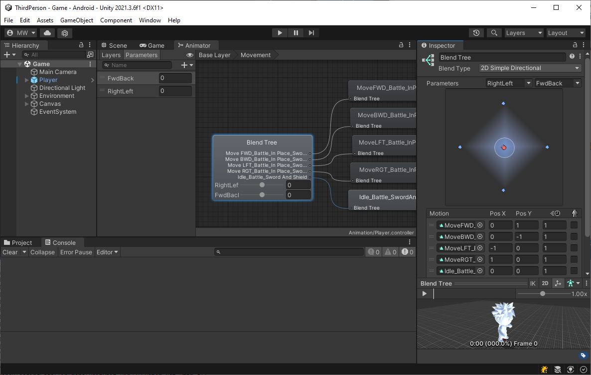
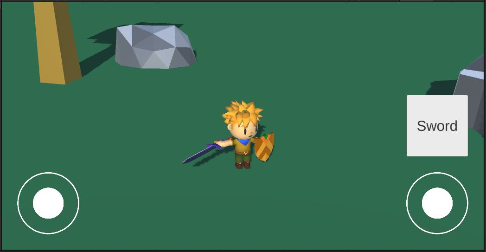

# Animation Controller
Let's set up some animations.

{: .todo}
* Create a new Animation Controller for your "Player"
* Set the Avatar to "Assets/RPG Tiny Hero Duo/Animation/SwordAndShield/Idle_Battle_SwordAndShiled.fbx"
* Add 2 float parameters
	* One for forward/backward speed
	* One for right/left speed
* Create a new Blend-Tree
* Set its Blend Type to "2D Simple Directional"
* Add the following animations:
	* "Assets/RPG Tiny Hero Duo/Animation/SwordAndShield/InPlace/MoveFWD_Battle_InPlace_SwordAndShield.fbx"
	* "Assets/RPG Tiny Hero Duo/Animation/SwordAndShield/InPlace/MoveBWD_Battle_InPlace_SwordAndShield.fbx"
	* "Assets/RPG Tiny Hero Duo/Animation/SwordAndShield/InPlace/MoveLFT_Battle_InPlace_SwordAndShield.fbx"
	* "Assets/RPG Tiny Hero Duo/Animation/SwordAndShield/InPlace/MoveRGT_Battle_InPlace_SwordAndShield.fbx"
	* "Assets/RPG Tiny Hero Duo/Animation/SwordAndShield/Idle_Battle_SwordAndShiled.fbx"
* Set up the blend parameters accordingly

# Character Update
Now we need to just control those animations.

{: .todo}
* In `Character.Start()` grab the **Animator** and store it in a member variable
* In `Character.Update()`, convert the *world-space* input controls into *object-space*
* Feed the *object-space* version of the movement vector into the 2 float parameters you put on the Animation Controller

{: .note}
If you're paying attention, you'll remember that the input controls started out in *camera-space*.\
We converted them into *world-space*, and now we're converting them into *object-space*.\
Also, the player faces the same direction as the camera, so that's basically back to the way we started.\
But remember, we are planning (in the next lab) to apply this controller to an NPC.

{: .test}
As you run around, you should see your character animating.

# Spin Attack
Finally let's add an attack animation.

{: .todo}
* Add a trigger parameter to your Animator
* Add "Assets/RPG Tiny Hero Duo/Animation/SwordAndShield/Attack04_SwordAndShiled.fbx" to your Animator
* Create a transition from the "Any State" to your new attack animation
	* Make it transition on the trigger you just made
* Create an exit transition from the attack animation back to the main blend tree

# Character.cs

{: .todo}
* Add a bool input to `Character.CharInput` for your attack
* In `Character.Update()` set the attack input on the leading edge of the space bar
	* `Input.GetKeyDown(KeyCode.Space)`
* Later on in `Character.Update()` if the attack input is true, set the trigger on the Animator
* After you've checked the attack input, set it back to false for the next frame

{: .note}
This may seem silly, but we're abstracting the attack input for the next part.

{: .test}
You should be able to press the space bar to make your character do a spinning attack.

# Attack Button

{: .todo}
* Create a public function in your **Character** class to set the attack input
* Create a UI Button for the attack move
* Connect your UI button to the public function

{: .test}
Your character can run around and even twirl his sword in a mobile build now.

{: .warn}
Commit and push before we do the "Choose Your Path"